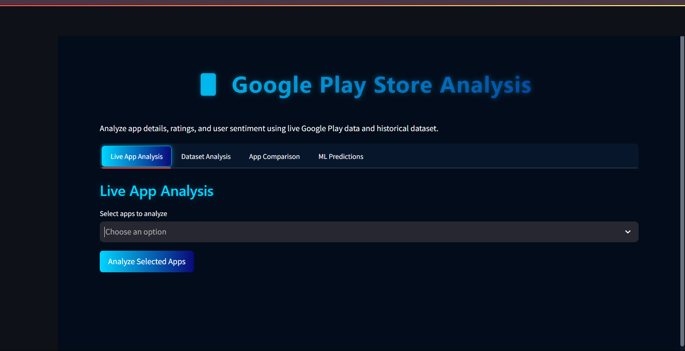
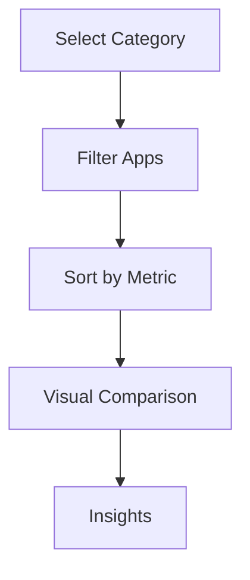

# 📱 Google Play Store Analytics Dashboard



An advanced analytics platform for comprehensive Google Play Store app analysis, providing actionable insights through real-time data and machine learning.

## 🌟 Key Features

### 🔍 Live App Analysis
| Feature | Description | Technology |
|---------|-------------|------------|
| Real-time Data Fetching | Get current app metrics directly from Google Play | google-play-scraper |
| Sentiment Analysis | Categorize reviews as Positive/Negative/Neutral | TextBlob |
| Fake Review Detection | Identify suspicious reviews using ML | Isolation Forest |
| Visual Analytics | Word clouds and interactive charts | WordCloud, Plotly |

### 📈 Historical Analysis
- Category distribution trends
- Rating patterns over time
- Price sensitivity analysis
- Content rating benchmarks
- Free vs Paid app performance

### ↔️ Comparative Analysis


### 🤖 ML Predictions
1. App success probability
2. Rating prediction engine
3. Feature importance analysis
4. Automated recommendations

## 🛠️ Technology Stack

**Frontend**
- Streamlit (Python web framework)
- Custom Dark/AI Theme (CSS)
- Plotly & Matplotlib (Visualization)

**Backend**
```python
# Core processing
import pandas as pd
import numpy as np
from sklearn.ensemble import RandomForestRegressor, IsolationForest

# NLP
from textblob import TextBlob
from wordcloud import WordCloud

# Data collection
from google_play_scraper import app, reviews
```

## 🗃️ Data Pipeline

```plaintext
Live Data → 
Data Cleaning → 
Feature Engineering → 
Analysis → 
Visualization → 
Insights
```

## 🚀 Installation & Usage

```bash
# Clone repository
git clone https://github.com/yourusername/play-store-analytics.git
cd play-store-analytics

# Install dependencies
pip install streamlit pandas numpy matplotlib plotly wordcloud google-play-scraper textblob scikit-learn

# Launch application
streamlit run app.py
```

**System Requirements**
- Python 3.8+
- 8GB RAM (for ML components)
- Stable internet connection

## 📊 Sample Outputs

**Sentiment Analysis**


**Rating Prediction**
```python
# Sample prediction output
{
    "Predicted_Rating": 4.2,
    "Confidence": 0.85,
    "Key_Factors": ["App Size", "Category", "Price"]
}
```

## 🎯 Business Applications

| Industry | Use Case |
|----------|----------|
| App Development | Feature prioritization |
| Marketing | Review sentiment tracking |
| Product Management | Competitor benchmarking |
| Investment | Market trend analysis |

## 📌 Coming Soon

- [ ] User review timeline analysis
- [ ] Cross-platform comparison (iOS vs Android)
- [ ] Advanced review clustering
- [ ] Automated report generation

## 👨‍💻 Developer

**Naman**  
[](https://linkedin.com/in/naman-upreti) 
[](https://github.com/naman-upreti)

## 📝 License

MIT License  
[](https://opensource.org/licenses/MIT)

## 🤝 How to Contribute

1. Fork the repository
2. Create your feature branch (`git checkout -b feature/AmazingFeature`)
3. Commit your changes (`git commit -m 'Add some AmazingFeature'`)
4. Push to the branch (`git push origin feature/AmazingFeature`)
5. Open a Pull Request

**Bug Reports & Feature Requests**  
Please use the [issue tracker](https://github.com/naman-upreti/play-store-analytics/issues)

---

<div align="center">
  <sub>Built with ❤︎ by Naman</sub>
</div>
# GooglePlay-Analysis
#
